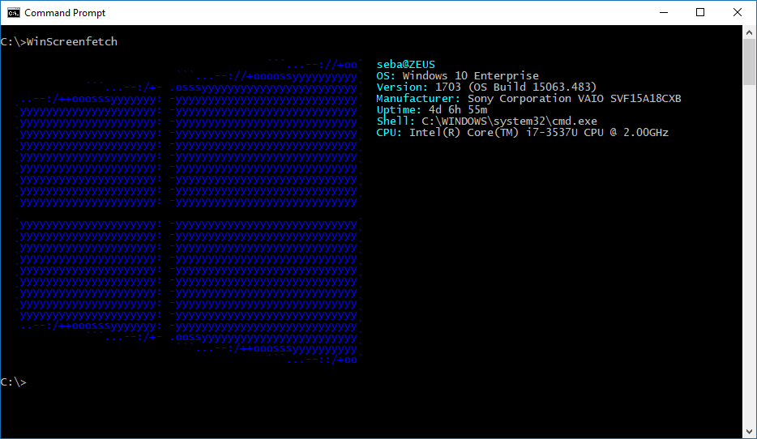

WinScreenfetch
=============
screenfetch for Windows

Tired of seeing those cool ascii Linux distro's logos? now you can have your own in your favorite OS.

WinScreenfetch is exactly that. screenfetch for Windows.

The ASCII art was created thanks to this site: 				//http://www.text-image.com/convert/ascii.html
